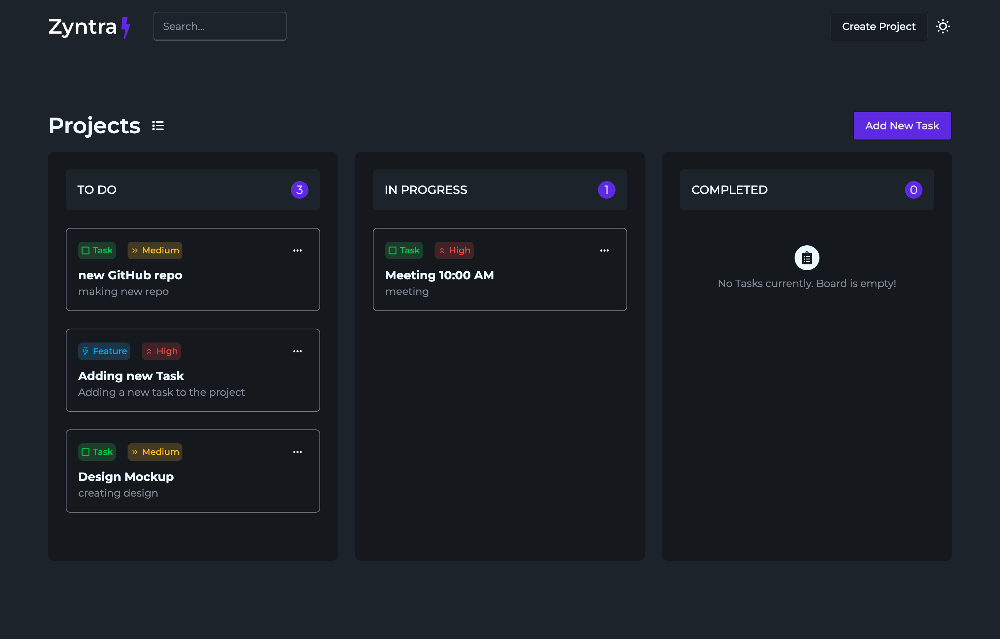
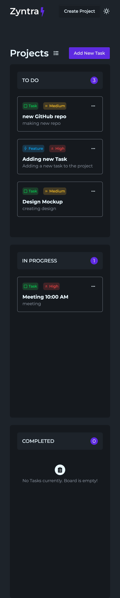

# Zyntra - Kanban Task Manager

## 🚀 Live Demo

## 📌 Features

- Create / edit / delete tasks
- Drag & drop within columns
- Local storage persistence
- Dark/Light theme with context
- Toast notifications
- Task types & priorities
- Modal system

## 🛠 Tech Stack

- React + Zustand
- React Hot Toast
- DnD Kit
- Daisy UI + Tailwind
- LocalStorage

## 📚 What I Learned
- Proper state structure: store only IDs globally and derive UI locally
- Pattern for immutable updates (spread + nested maps)
- Separation of render/UI state vs. app logic
- Drag & drop reordering with DnD Kit
- Theming with Context + DaisyUI
- Toast Notification Architecture
- Professional Git Workflow (branches, merge strategy, commits)

## Screenshots

### Desktop

### Mobile

